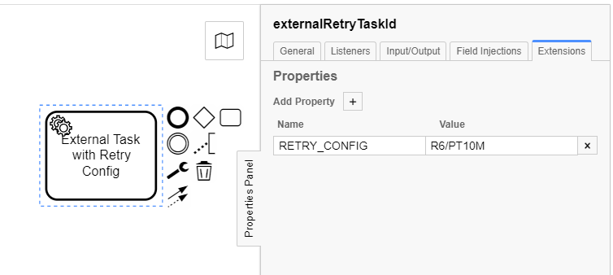

# external-task-retry-aspect
[](https://search.maven.org/artifact/de.viadee.bpm.camunda/external-task-retry-aspect-spring-boot-starter)


[](https://github.com/viadee/external-task-retry-aspect/issues)
[](https://github.com/viadee/external-task-retry-aspect/stargazers)

## Description
This tool helps to control the retry-behaviour in external-task-handlers based on the
official [java-client](https://docs.camunda.org/manual/latest/user-guide/ext-client/) provided
by [Camunda BPM](https://docs.camunda.org/manual/latest/user-guide/ext-client/).

## Features
* Retry-behaviour for external-tasks can be configured in process-models as known from `JavaDelegates`
  like `R3/PT1M`, meaning *three times each after one minute*
* Every `Exception` leads to a retry  - no manual handling within handlers necessary
* Special error-type to force instant incidents - skipping any retry-behaviour
* Additional error-type to create a business-error, which must be handled in process
* Configurable default retry-behaviour

## How to use
1. Besides the `camunda-external-task-client` dependency, the following maven-coordinate needs to be added to the `pom.xml`. As
a `spring-boot-starter`, the aspect will be loaded automatically as soon as the handler-application starts:
```xml
<dependencies>
    <dependency>
        <groupId>org.camunda.bpm</groupId>
        <artifactId>camunda-external-task-client</artifactId>
        <version>{external-task-client.version}</version>
    </dependency>

    <dependency>
        <groupId>de.viadee.bpm.camunda</groupId>
        <artifactId>external-task-retry-aspect-spring-boot-starter</artifactId>
        <version>1.2.0</version>
    </dependency>
</dependencies>
```
2. Add extension-property to an external-task:

   - The property-name is configurable (see below), default: `RETRY_CONFIG`
   - Possible values might be, default: `R3/PT5M`
     - `R1/P1D`: 1 retry after 1 day
     - `R2/PT2H`: 2 retries after 2 hours each
     - `R3/PT3M`: 3 retries after 3 minutes each
     - `PT5M,PT10M,PT20M,PT1H,PT12H,P1D`: 6 increasing retries; 5, 10, 20 minutes, 12 hours, 1 day


3. Make sure, the `ExternalTaskHandler` is capable to access extension-properties :
```java
public class HandlerConfig {

    @Autowired // e.g. spring component
    private ExternalTaskHandler myExternalTaskHandler;
    
    public void openHandler() {
        new ExternalTaskClientBuilderImpl()
                .baseUrl("http://camunda/engine-rest").build()
                    .subscribe("worker-topic")
                    .handler(myExternalTaskHandler)   // injected spring component
                    .includeExtensionProperties(true) // important, bc. the default: false
                    .open();
    }
}
```
### Configuration options
These properties are available, they can be set e.g. in `application.properties`:

```properties
# Default retry-behaviour, if no retry is configured. 
# Whenever this property is configured incorrectly, 'R3/PT5M' is also used as fallback
de.viadee.bpm.camunda.external-task.default-retry-config=R3/PT5M

# Identifier used in bpmn-extension-properties, default=RETRY_CONFIG
de.viadee.bpm.camunda.external-task.retry-config-name=RETRY_CONFIG
```

## How this might help?
A comparison of some `ConventionalHandler` with an `AspectedHandler` explains how the error-handling 
can be completely left out, because anything is done by the `retry-aspect`:

### `ConventionalHandler` without retry-aspect
```java
public class ConventionalHandler implements ExternalTaskHandler {

    @Override
    public void execute(ExternalTask task, ExternalTaskService service) {
        try {
            // do some business-logic and complete if fine...
            service.complete(task);

            // ...or maybe end with some bpmn-error, that has to be handled within process
            service.handleBpmnError(task, "bpmn-error-code");

        } catch (Exception error) {
            // catch errors and think about retries and timeout
            service.handleFailure(task,
                    "error-message",        // shown in Camunda Cockpit
                    "error-details",        // e.g. stacktrace, available in Camunda Cockpit
                    task.getRetries() - 1,  // how many retries are left? (initial null)
                    300000L);               // time to next retry in ms
        }
    }
}

```

### `AspectedHandler` using retry-aspect

* No `try-catch` needed, this is done automatically
* `ExternalTaskBusinessError` can be used to trigger `handleBpmnError()`
* `InstantIncidentException` can be used to skip retries and create an incident instantly

```java
public class AspectedHandler implements ExternalTaskHandler {

    @Override
    public void execute(ExternalTask task, ExternalTaskService service) {
        // do some business-logic and complete if fine...
        service.complete(task);

        // ...or maybe end with some bpmn-error, that has to be handled within process
        throw ExternalTaskBusinessError("bpmn-error-code");
    }
}
```

## Collaboration
This tool was build by viadee Unternehmensberatung AG. If you are interested to find out what 
else we are doing, check out our website [viadee.de](https://www.viadee.de/en). 
If you have any feedback, ideas or extensions feel free to contact or create a GitHub issue.

## Contact

[](https://twitter.com/rnschk)

## License

[](https://github.com/viadee/external-task-retry-aspect/blob/master/LICENSE)
